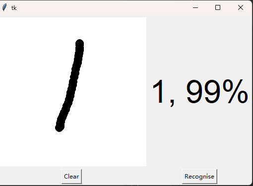
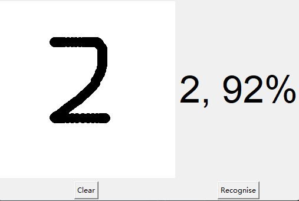

# pytorch + MNIST + Tkinter 手写数字识别

## 效果




## 使用说明

- 进行训练运行digital_train.py
- 直接测试运行model_show.py

## 安装

python 3.8

### 创建虚拟环境

```
python -m venv venv
```

### 安装依赖

```
pip install -r requirements.txt
```

### 运行

```
python model_show.py
```

## 参考链接

知乎：https://zhuanlan.zhihu.com/p/137571225

可视化：https://data-flair.training/blogs/python-deep-learning-project-handwritten-digit-recognition/